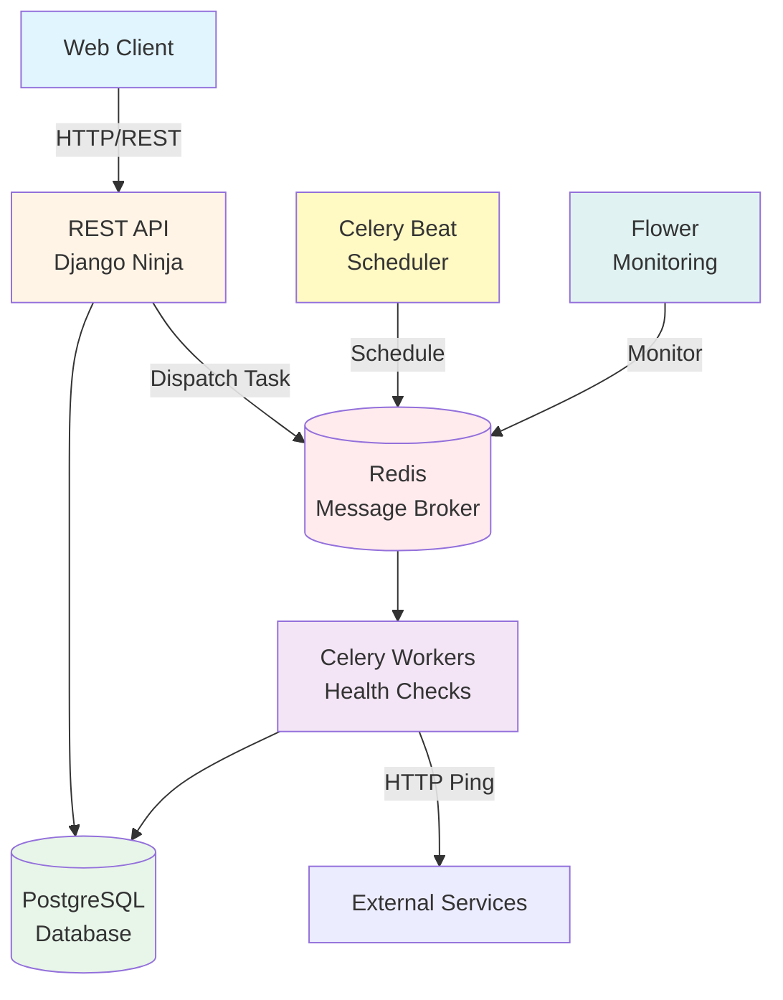

<div align="center">

# 🔍 Sentinel

### Distributed Synthetic Monitoring System

[](https://choosealicense.com/licenses/mit/)
[](https://www.python.org/)
[](https://www.djangoproject.com/)
[](https://www.docker.com/)
[](https://github.com/omaryesith/sentinel/actions/workflows/ci.yml)

*A distributed synthetic monitoring platform designed to verify availability and latency of web services in real-time with automated health checks and performance tracking.*

> [!NOTE]
> **Portfolio Demonstration Project**  
> This is a demonstration project showcasing a **Distributed Synthetic Monitoring System**, emphasizing microservices patterns and asynchronous task orchestration. It is part of my professional portfolio to demonstrate technical skills in Django, Celery, periodic task scheduling with Beat, distributed queue management with Redis, and containerized deployment.

[Features](#-features) •
[Architecture](#-architecture) •
[Quick Start](#-quick-start) •
[API Documentation](#-api-documentation) •
[Contributing](#-contributing)

</div>

---

## 📖 Overview

**Sentinel** is a cutting-edge distributed synthetic monitoring platform that enables real-time verification of web service availability and performance. Built with a **microservices architecture** and powered by asynchronous task processing, Sentinel delivers automated health checks, latency tracking, and comprehensive observability without manual intervention.

### ✨ Features

- 🔄 **Automated Monitoring** - Scheduled health checks every minute via Celery Beat
- ⚡ **Asynchronous Processing** - Non-blocking HTTP requests using Celery workers
- 📊 **Performance Tracking** - Store and query latency metrics over time
- 🎯 **RESTful API** - Clean, schema-driven REST API powered by Django Ninja
- 📈 **Real-time Observability** - Monitor task queues with Flower dashboard
- 🐳 **Docker-First** - Fully containerized with Docker Compose orchestration
- 🔍 **Automatic Documentation** - Interactive Swagger/OpenAPI documentation
- 💾 **Persistent Storage** - PostgreSQL for reliable data persistence
- 🔄 **CI/CD Pipeline** - Automated testing with GitHub Actions
- 🔧 **Developer Friendly** - Comprehensive Makefile commands and clear documentation

---

## 🏗 Architecture

### Tech Stack

<div align="center">

| Layer | Technology | Purpose |
|-------|-----------|---------|
| **Backend** | Python 3.11 + Django 5 | Core application logic |
| **API** | Django Ninja | Schema-driven REST API framework |
| **Task Queue** | Celery 5.3 | Asynchronous background jobs |
| **Scheduler** | Celery Beat | Cronjob orchestration (health checks) |
| **Message Broker** | Redis 7 | Task queue and result backend |
| **Database** | PostgreSQL 15 | Primary data persistence |
| **HTTP Client** | HTTPX | Async-ready HTTP requests |
| **Monitoring** | Flower | Worker and queue monitoring |
| **Dependencies** | Poetry | Python package management |
| **Container** | Docker + Docker Compose | Service orchestration |

</div>

### System Architecture



### Data Flow

**Automated Monitoring Flow:**
Sentinel implements a distributed task queue pattern where Celery Beat schedules periodic health checks that are executed asynchronously by worker nodes.

**Example Flow:**
1. Celery Beat triggers scheduled task every minute
2. Task is dispatched to Redis queue
3. Available Celery worker picks up task from queue
4. Worker performs HTTP request to monitored endpoint
5. Worker records latency, status code, and timestamp to PostgreSQL
6. Results are available via REST API for querying

**Manual Check Flow:**
1. Client triggers manual check via REST API (`POST /api/monitoring/{id}/check`)
2. API dispatches task to Redis queue asynchronously
3. Worker processes health check and stores result
4. Client can query results via history endpoint

---

## 🚀 Quick Start

### Prerequisites

Ensure you have the following installed:

- **Docker** (v20.10+) & **Docker Compose** (v2.0+)
- **Make** (optional, for convenience commands)
- **Git**

### Installation

1️⃣ **Clone the repository:**

```bash
git clone https://github.com/omaryesith/sentinel.git
cd sentinel
```

2️⃣ **Configure environment:**

```bash
cp .env.example .env
ln -s ../.env app/.env
# The .env file is in root (for Docker) with a symlink in app/ (for Django)
# Modify .env if needed for your environment
```

3️⃣ **Start the application:**

**Option A: Using Make (Recommended)**
```bash
make setup
# This will: build images, run migrations, and create a superuser
```

**Option B: Using Docker Compose directly**
```bash
docker compose up --build -d
docker compose run --rm web python manage.py migrate
docker compose run --rm web python manage.py createsuperuser
```

4️⃣ **Access the services:**

| Service | URL | Description |
|---------|-----|-------------|
| 📚 **API Docs (Swagger)** | http://localhost:8000/api/docs | Interactive API documentation |
| 🔐 **Admin Panel** | http://localhost:8000/admin | Django admin interface |
| 📊 **Flower Dashboard** | http://localhost:5555 | Celery worker monitoring |

### Default Setup

After running `make setup`, the system will:
- Build all Docker containers
- Initialize PostgreSQL database
- Run Django migrations
- Prompt for superuser creation
- Start all services (API, Workers, Beat, Flower)

---

## 🛠 Development Commands

The project includes a comprehensive `Makefile` for common operations:

```bash
# Setup & Build
make setup           # Complete setup: build, migrate, create superuser
make build           # Build Docker images

# Running Services
make up-dev          # Start all services in foreground (dev mode)
make up              # Start all services in background (detached mode)
make down            # Stop all services
make logs            # View real-time logs from all services

# Development
make shell           # Open Django shell
make migrate         # Run pending migrations
make makemigrations  # Create new migrations

# Testing & QA
make test            # Run pytest test suite

# Maintenance
make clean           # Remove __pycache__ and volumes
make help            # Show all available commands
```

---

## 📡 API Documentation

### Core Endpoints

#### Domains

| Method | Endpoint | Description |
|--------|----------|-------------|
| `POST` | `/api/domains/` | Register new domain to monitor |
| `GET` | `/api/domains/` | List all registered domains |
| `GET` | `/api/domains/{id}` | Get domain details |

#### Monitoring

| Method | Endpoint | Description |
|--------|----------|-------------|
| `POST` | `/api/monitoring/{id}/check` | Trigger manual health check |
| `GET` | `/api/monitoring/{id}/history` | Get latency history (last 50 checks) |

### Example: Register a Domain

```bash
curl -X POST http://localhost:8000/api/domains/ \
  -H "Content-Type: application/json" \
  -d '{
    "name": "Production API",
    "url": "https://api.example.com",
    "is_active": true
  }'
```

**Response:**
```json
{
  "id": 1,
  "name": "Production API",
  "url": "https://api.example.com",
  "is_active": true,
  "created_at": "2025-11-26T01:00:00Z"
}
```

### Example: Trigger Manual Check

```bash
curl -X POST http://localhost:8000/api/monitoring/1/check
```

**Response:**
```json
{
  "message": "Check dispatched successfully",
  "task_id": "abc123-def456-ghi789",
  "domain": "Production API"
}
```

### Example: View Performance History

```bash
curl http://localhost:8000/api/monitoring/1/history
```

**Response:**
```json
[
  {
    "id": 1,
    "domain_id": 1,
    "checked_at": "2025-11-26T01:00:00Z",
    "latency_ms": 245.67,
    "status_code": 200,
    "is_success": true,
    "error_message": null
  },
  {
    "id": 2,
    "domain_id": 1,
    "checked_at": "2025-11-26T01:01:00Z",
    "latency_ms": 231.45,
    "status_code": 200,
    "is_success": true,
    "error_message": null
  }
]
```

For full API documentation, visit the **Swagger UI** at http://localhost:8000/api/docs after starting the server.

---

## 📁 Project Structure

```
sentinel/
├── .github/                   # GitHub configuration
│   └── workflows/             # CI/CD workflows
│       └── ci.yml             # Automated testing pipeline
├── app/                       # Django application source
│   ├── core/                  # Project configuration
│   │   ├── settings.py        # Django settings
│   │   ├── celery.py          # Celery configuration
│   │   └── urls.py            # URL routing
│   ├── domains/               # Domain management app
│   │   ├── models.py          # Domain model
│   │   ├── api.py             # REST API endpoints
│   │   ├── schemas.py         # Pydantic validation schemas
│   │   └── admin.py           # Django admin config
│   └── monitoring/            # Monitoring app
│       ├── models.py          # PingResult model
│       ├── api.py             # REST API endpoints
│       ├── tasks.py           # Celery tasks (health checks)
│       ├── services.py        # Business logic
│       └── schemas.py         # Pydantic validation schemas
├── docker/                    # Docker configuration
│   └── django/
│       ├── Dockerfile         # Python app container
│       └── start.sh           # Startup script
├── .env.example               # Environment variables template
├── docker-compose.yml         # Service orchestration
├── pyproject.toml             # Poetry dependencies
├── Makefile                   # Development commands
└── README.md                  # This file
```

---

## 🔧 Configuration

### Environment Variables

The `.env` file should be in the root directory (for Docker Compose) with a symlink at `app/.env` (for Django's python-decouple). Use the setup instructions above to configure this correctly.

| Variable | Description | Default | Production Notes |
|----------|-------------|---------|------------------|
| `SECRET_KEY` | Django secret key | `insecure-dev-key` | ⚠️ **Must change** |
| `DEBUG` | Debug mode | `True` | ⚠️ Set to `False` |
| `ALLOWED_HOSTS` | Allowed hostnames | `localhost,127.0.0.1` | Add your domain |
| `POSTGRES_DB` | Database name | `sentinel` | - |
| `POSTGRES_USER` | Database user | `postgres` | ⚠️ Use strong credentials |
| `POSTGRES_PASSWORD` | Database password | `postgres` | ⚠️ Use strong credentials |
| `POSTGRES_HOST` | Database host | `db` | - |
| `POSTGRES_PORT` | Database port | `5432` | - |
| `REDIS_URL` | Redis connection URL | `redis://redis:6379/0` | - |

> [!CAUTION]
> **Never commit `.env` to version control!** The `.env.example` file contains safe defaults for development only. Always generate strong, unique credentials for production deployments.

---

## 🧪 Testing

Run the test suite using pytest:

```bash
# Using Make
make test

# Using Docker Compose
docker compose run --rm web pytest

# Run with coverage
docker compose run --rm web pytest --cov=app --cov-report=html
```

### Continuous Integration

The project uses **GitHub Actions** for automated testing on every push and pull request to the `main` branch.

The CI pipeline automatically:
1. ✅ Checks out the code
2. 🏗️ Builds all Docker services
3. 🚀 Starts the service cluster
4. ⏳ Waits for database initialization
5. 🧪 Runs the test suite
6. 🧹 Tears down the environment

View the workflow configuration at [`.github/workflows/ci.yml`](.github/workflows/ci.yml)

---

## 🐛 Troubleshooting

### Port Already in Use

If port 8000 is already occupied:
```bash
# Find process using port 8000
sudo lsof -i :8000

# Kill the process or change port in docker-compose.yml
```

### Database Connection Issues

```bash
# Check if PostgreSQL is running
docker compose ps

# View database logs
docker compose logs db

# Restart database
docker compose restart db
```

### Redis Connection Issues

```bash
# Check Redis status
docker compose exec redis redis-cli ping
# Should respond: PONG

# View Redis logs
docker compose logs redis
```

### Celery Worker Not Processing Tasks

```bash
# Check worker status
docker compose logs celery_worker

# Check Flower dashboard
# Visit http://localhost:5555

# Restart workers
docker compose restart celery_worker celery_beat
```

### Migration Errors

```bash
# Reset database (⚠️ destroys data)
docker compose down -v
docker compose up -d db
docker compose run --rm web python manage.py migrate
```

---

## 📝 Development Notes

- **Poetry** manages Python dependencies (see `pyproject.toml`)
- **HTTPX** is used for async HTTP requests in Celery tasks
- **Redis** serves dual purpose: Celery broker + result backend
- **Migrations** are tracked in Git and should be committed
- **Celery Beat** requires persistent storage for schedule (uses database scheduler)

---

## 🚢 Deployment

### Production Considerations

1. **Environment Variables**: Set `DEBUG=False` and use a strong `SECRET_KEY`
2. **Database**: Use managed PostgreSQL service (AWS RDS, Google Cloud SQL, etc.)
3. **Redis**: Use managed Redis service (AWS ElastiCache, Redis Cloud, etc.)
4. **Static Files**: Configure static file serving with WhiteNoise or CDN
5. **HTTPS**: Use a reverse proxy (Nginx) with SSL certificates
6. **Monitoring**: Set up application monitoring (Sentry, DataDog, etc.)
7. **Scaling**: Scale Celery workers horizontally based on load
8. **Health Checks**: Implement health check endpoints for load balancers
9. **Logging**: Configure centralized logging (ELK stack, CloudWatch, etc.)

---

## 🤝 Contributing

Contributions are welcome! Please follow these steps:

1. Fork the repository
2. Create a feature branch (`git checkout -b feature/amazing-feature`)
3. Commit your changes (`git commit -m 'Add amazing feature'`)
4. Push to the branch (`git push origin feature/amazing-feature`)
5. Open a Pull Request

### Code Style

This project uses:
- **Black** for code formatting
- **isort** for import sorting
- **pytest** for testing

Run formatters before committing:
```bash
docker compose run --rm web black app/
docker compose run --rm web isort app/
```

---

## 📄 License

This project is licensed under the **MIT License** - see the [LICENSE](LICENSE) file for details.

---

## 🙏 Acknowledgments

- Built with [Django](https://www.djangoproject.com/)
- API framework: [Django Ninja](https://django-ninja.rest-framework.com/)
- Task processing: [Celery](https://docs.celeryq.dev/)
- HTTP client: [HTTPX](https://www.python-httpx.org/)

---

<div align="center">

**Made with ❤️ by [Omar Alvarado](https://github.com/omaryesith)**

⭐ Star this repo if you find it useful!

</div>
